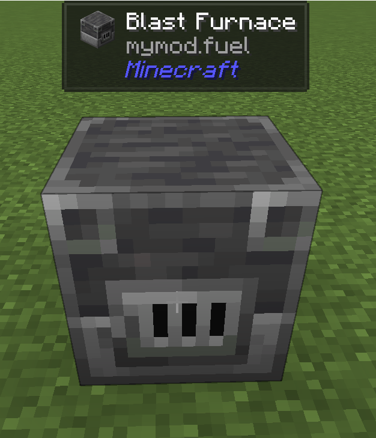
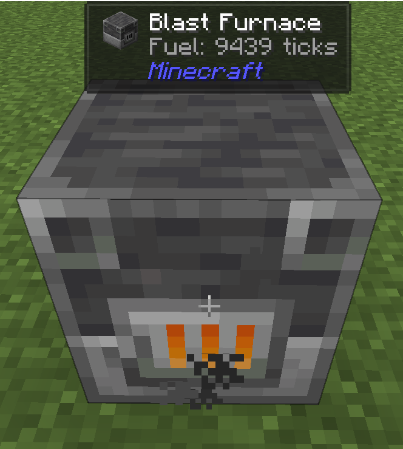
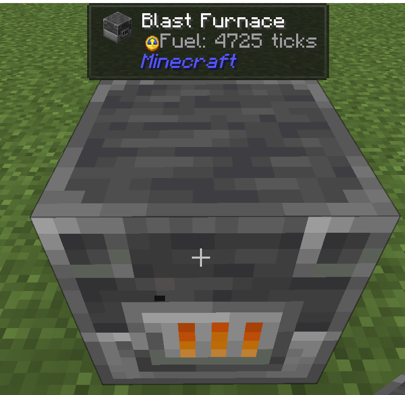
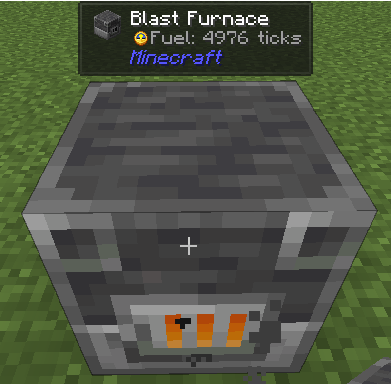

# Getting Started

## Setup

In your `build.gradle`:

``` groovy
repositories {
    maven {
        url "https://www.cursemaven.com"
        content {
            includeGroup "curse.maven"
        }
    }
}

dependencies {
    // Visit https://www.curseforge.com/minecraft/mc-mods/jade/files/all?filter-status=1&filter-game-version=2020709689%3A7498
    // to get the latest version's jade_id
    implementation fg.deobf("curse.maven:jade-324717:${jade_id}")
}
```

Visit [CurseMaven](https://www.cursemaven.com/) to find more information about how to set up your workspace.

## Registering

``` java
package mcp.mobius.waila.test;

import mcp.mobius.waila.api.IWailaClientRegistration;
import mcp.mobius.waila.api.IWailaCommonRegistration;
import mcp.mobius.waila.api.IWailaPlugin;
import mcp.mobius.waila.api.WailaPlugin;

@WailaPlugin
public class ExamplePlugin implements IWailaPlugin {

  @Override
  public void register(IWailaCommonRegistration registration) {
    //TODO register data providers and config options here
  }

  @Override
  public void registerClient(IWailaClientRegistration registration) {
    //TODO register component providers and icon providers here
  }

}
```

## Component Provider

Component providers can append information (texts or images) to the tooltip.

Let's create a simple block component provider that adds an extra line to all the furnaces:

``` java
package mcp.mobius.waila.test;

import mcp.mobius.waila.api.BlockAccessor;
import mcp.mobius.waila.api.IComponentProvider;
import mcp.mobius.waila.api.ITooltip;
import mcp.mobius.waila.api.config.IPluginConfig;
import net.minecraft.network.chat.TranslatableComponent;

public enum ExampleComponentProvider implements IComponentProvider {

  INSTANCE;

  @Override
  public void appendTooltip(ITooltip tooltip, BlockAccessor accessor, IPluginConfig config) {
    tooltip.add(new TranslatableComponent("mymod.fuel"));
  }

}
```

Here you have the `tooltip` that you can do many various operations to the tooltip. You can take the `tooltip` as a list of `Component`. But here our elements are `IElement`s, to support displaying images, not just texts. In this case we only added a single line.

You also have the `accessor`, which you can get access to the context. We will use it later.

Then register our `ExampleComponentProvider`:

``` java
package mcp.mobius.waila.test;

import mcp.mobius.waila.api.IWailaClientRegistration;
import mcp.mobius.waila.api.IWailaCommonRegistration;
import mcp.mobius.waila.api.IWailaPlugin;
import mcp.mobius.waila.api.TooltipPosition;
import mcp.mobius.waila.api.WailaPlugin;
import net.minecraft.world.level.block.AbstractFurnaceBlock;

@WailaPlugin
public class ExamplePlugin implements IWailaPlugin {

  @Override
  public void register(IWailaCommonRegistration registration) {
    //TODO register data providers and config options here
  }

  @Override
  public void registerClient(IWailaClientRegistration registration) {
    registration.registerComponentProvider(ExampleComponentProvider.INSTANCE, TooltipPosition.BODY, AbstractFurnaceBlock.class);
  }

}
```

Here the `TooltipPosition.BODY` means we will append our text between the block name and the mod name.

`AbstractFurnaceBlock.class` means we will append our text only when the block is extended from `AbstractFurnaceBlock`.

Now launch the game:



Congrats you have implemented your first Jade plugin!

## Server Data Provider

`IServerDataProvider` can help you sync data that is not on client side. In this tutorial it is the remaining burn time of the furnace. It will sync to the client every 250 milliseconds.

This is a chart shows the basic lifecycle:


Now it's time to implement our `IServerDataProvider`:

``` java
package mcp.mobius.waila.test;

import mcp.mobius.waila.api.BlockAccessor;
import mcp.mobius.waila.api.IComponentProvider;
import mcp.mobius.waila.api.IServerDataProvider;
import mcp.mobius.waila.api.ITooltip;
import mcp.mobius.waila.api.config.IPluginConfig;
import net.minecraft.nbt.CompoundTag;
import net.minecraft.network.chat.TranslatableComponent;
import net.minecraft.server.level.ServerPlayer;
import net.minecraft.world.level.Level;
import net.minecraft.world.level.block.entity.AbstractFurnaceBlockEntity;
import net.minecraft.world.level.block.entity.BlockEntity;

public enum ExampleComponentProvider implements IComponentProvider, IServerDataProvider<BlockEntity> {

  INSTANCE;

  @Override
  public void appendTooltip(ITooltip tooltip, BlockAccessor accessor, IPluginConfig config) {
    if (accessor.getServerData().contains("Fuel")) {
      tooltip.add(new TranslatableComponent("mymod.fuel", accessor.getServerData().getInt("Fuel")));
    }
  }

  @Override
  public void appendServerData(CompoundTag data, ServerPlayer player, Level world, BlockEntity t, boolean showDetails) {
    AbstractFurnaceBlockEntity furnace = (AbstractFurnaceBlockEntity) t;
    data.putInt("Fuel", furnace.litTime);
  }

}
```

Here we used [Access Transformer](https://forge.gemwire.uk/wiki/Access_Transformers) or [Access Wideners](https://fabricmc.net/wiki/tutorial:accesswideners) to get access to the protected field.

Register `IServerDataProvider`:

``` java
package mcp.mobius.waila.test;

import mcp.mobius.waila.api.IWailaClientRegistration;
import mcp.mobius.waila.api.IWailaCommonRegistration;
import mcp.mobius.waila.api.IWailaPlugin;
import mcp.mobius.waila.api.TooltipPosition;
import mcp.mobius.waila.api.WailaPlugin;
import net.minecraft.world.level.block.AbstractFurnaceBlock;
import net.minecraft.world.level.block.entity.AbstractFurnaceBlockEntity;

@WailaPlugin
public class ExamplePlugin implements IWailaPlugin {

  @Override
  public void register(IWailaCommonRegistration registration) {
    registration.registerBlockDataProvider(ExampleComponentProvider.INSTANCE, AbstractFurnaceBlockEntity.class);
  }

  @Override
  public void registerClient(IWailaClientRegistration registration) {
    registration.registerComponentProvider(ExampleComponentProvider.INSTANCE, TooltipPosition.BODY, AbstractFurnaceBlock.class);
  }

}
```

Don't forget to add translation:

``` json
{
  "mymod.fuel": "Fuel: %d ticks"
}
```

Great!



## Showing an Item

Now let's show a clock as a small icon:

``` java
@Override
public void appendTooltip(ITooltip tooltip, BlockAccessor accessor, IPluginConfig config) {
  if (accessor.getServerData().contains("Fuel")) {
    IElementHelper elements = tooltip.getElementHelper();
    IElement icon = elements.item(new ItemStack(Items.CLOCK), 0.5f);
    tooltip.add(icon);
    tooltip.append(new TranslatableComponent("mymod.fuel", accessor.getServerData().getInt("Fuel")));
  }
}
```

Result:



Hmmm, would be better if we do some fine-tuning:

``` java 
@Override
public void appendTooltip(ITooltip tooltip, BlockAccessor accessor, IPluginConfig config) {
  if (accessor.getServerData().contains("Fuel")) {
    IElementHelper elements = tooltip.getElementHelper();
    IElement icon = elements.item(new ItemStack(Items.CLOCK), 0.5f).size(new Vec2(10, 10)).translate(new Vec2(0, -1));
    tooltip.add(icon);
    tooltip.append(new TranslatableComponent("mymod.fuel", accessor.getServerData().getInt("Fuel")));
  }
}
```

Result:



Much better now!
